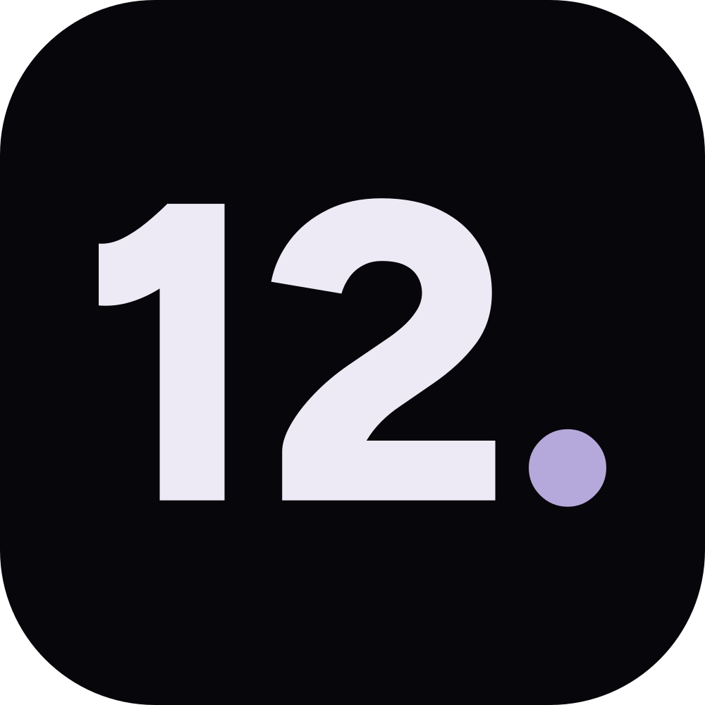

  

<h1 align="center">twelve.</h1>

  Creative studio · Omaha, Nebraska 
  <a href="https://bytw12ve.com"><b>bytw12ve.com</b></a>

---

Hi, I'm Jaycee. **twelve.** is my studio. It's where I make apps, websites and games, and where I keep everything I've built. It's just me, here in Omaha.

The name comes from my birthday, February 12th. Twelve has always been my number, and purple is my favorite color, so the whole studio is pretty much me.

This repository is the studio's website.

## What's on the site

| | |
| --- | --- |
| **Home** | One screen: a star field that reacts to your cursor, a pixel landscape, and the wordmark. Scroll down and the menu opens |
| **My work** | Finished projects that are out in the world, starting with the 402 |
| **About** | Who I am, what I made growing up, and why twelve. exists |
| **Side projects** | Things I'm building, testing or still figuring out, like keebwiki and wake. |
| **Contact** | The easiest way to reach me |

### The 402

**The 402** is my app for finding things to do around Omaha: tonight, this weekend, and near you. Its page on the site has its own look, taken from the app, and it's where you can [join the beta](https://bytw12ve.com/work/the-402#beta) before it opens on **October 31, 2026**. The app's [privacy policy](https://bytw12ve.com/402/privacy), [terms](https://bytw12ve.com/402/terms), [support](https://bytw12ve.com/402/support) and [account deletion](https://bytw12ve.com/402/delete-account) pages live here too.

## How it's made

- **The star field** on the homepage is a single canvas. Hundreds of stars twinkle, a few flare, and the ones near your cursor drift away from it. It pauses whenever you can't see it.
- **The pixel landscape** isn't an image. It's generated in code from a fixed seed, so it's the same every visit, and its clouds drift a pixel at a time.
- **Every colour, size and space** comes from one set of design tokens. A check compares them against the design document on every change, so the site can't quietly drift from its design.
- **No trackers.** No analytics, no cookies, no third-party scripts. The fonts are hosted on the site itself.
- **Accessible by default.** Every page is checked for accessibility on every change, every control works from the keyboard, and all the motion switches off if you've asked your device to reduce it.
- Built with Next.js and TypeScript, styled with CSS Modules, rendered as static pages, and hosted on Vercel.

## For contributors

The project's decisions and current status live in [`docs/`](docs). Start with [`docs/STATE.md`](docs/STATE.md), then [`docs/TWELVE.md`](docs/TWELVE.md). How to run and check the site is in [`docs/BUILD.md`](docs/BUILD.md#working-on-this-repo).

---

  © 2026 twelve. All rights reserved. 
  Figtree, Archivo, Space Mono, Bricolage Grotesque, Instrument Sans and DM Mono are used under the SIL Open Font License.

